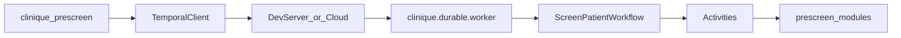
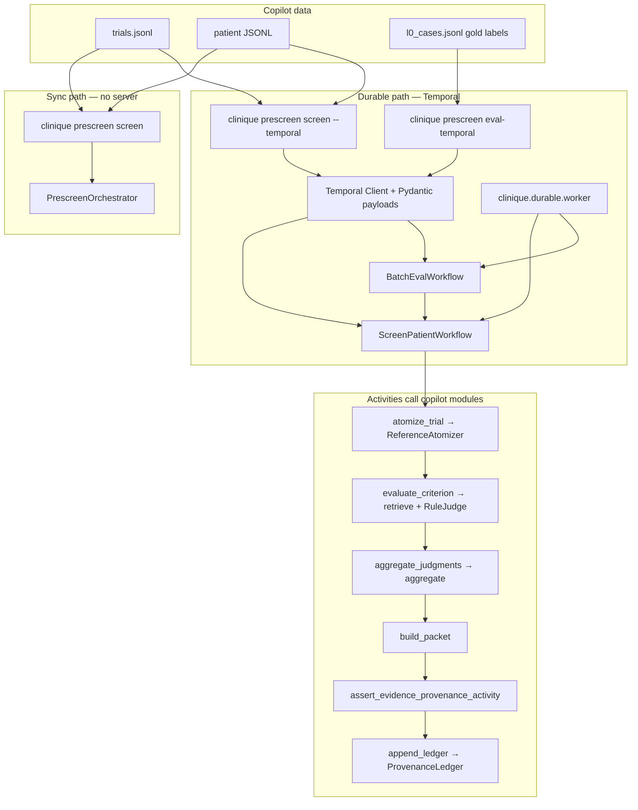

# Temporal.io durable prescreen

**Status:** implemented (local dev). Wraps the prescreen typed graph in [Temporal.io](https://github.com/temporalio/temporal) workflows and activities for durable, replayable execution.

## Naming note

This document refers to **Temporal.io** (durable execution platform). It is unrelated to:

- `src/clinique/prescreen/temporal.py` — prescreen **time-window** checks (lookback, leakage)
- The JavaScript `Temporal` date API

The Python package lives under `src/clinique/durable/` to avoid that collision.

## Architecture



| Workflow | Purpose |
|---|---|
| `ScreenPatientWorkflow` | One trial + patient screen: atomize → **parallel** per-criterion evaluate → aggregate → evidence gate → optional ledger |
| `BatchEvalWorkflow` | Eval cases via concurrent child `ScreenPatientWorkflow` runs (up to `BATCH_EVAL_CONCURRENCY`) + metrics report |

Activities are thin wrappers over existing prescreen code (`ReferenceAtomizer`, `retrieve`, `RuleJudge`, `aggregate`, `assert_evidence_provenance`). Wire payloads use **Pydantic v2** models in `durable/models.py` with `pydantic_data_converter`; domain logic still uses stdlib dataclasses from `prescreen/schemas.py`.

## Single-activity orchestrator (non-goal)

`PrescreenOrchestrator.screen()` is intentionally **not** exposed as a Temporal activity. Per-criterion activities preserve independent retry and Temporal history visibility. The sync orchestrator remains the offline oracle for tests.

## Dependencies

`temporalio` and `pydantic` are **optional** dependency group members — the core package stays stdlib-only:

```bash
uv sync --group temporal
```

CLI commands that need Temporal print `uv sync --group temporal` when the SDK is missing.

## Local development

1. Install the [Temporal CLI](https://docs.temporal.io/cli) (e.g. `brew install temporal`).

2. Start the dev server (SQLite, UI at http://localhost:8233):

   ```bash
   temporal server start-dev
   ```

3. Install the Python SDK group and start a worker:

   ```bash
   uv sync --group temporal
   uv run clinique prescreen worker
   ```

4. Run a screen via Temporal (in another terminal):

   ```bash
   # Normalize Synthea fixture first if needed
   uv run clinique prescreen normalize-synthea \
     --csv-dir tests/fixtures/prescreen/synthea \
     --snapshot 2026-03-01 \
     --out /tmp/synthea_patients.jsonl

   uv run clinique prescreen screen --temporal \
     --trial-id NCT02578680 \
     --patient-id P1 \
     --trials tests/fixtures/prescreen/trials.jsonl \
     --patients /tmp/synthea_patients.jsonl
   ```

   Omit `--temporal` to use the synchronous `PrescreenOrchestrator` path (no server/worker required).

5. Batch eval over workstream cases:

   ```bash
   uv run clinique prescreen eval-temporal \
     --cases .workstream/prescreen-copilot/l0_cases.jsonl \
     --trials tests/fixtures/prescreen/trials.jsonl \
     --synthea-patients /tmp/synthea_patients.jsonl
   ```

## CLI exit codes

| Command | Codes |
|---|---|
| `prescreen worker` | 0 running; 2 missing SDK / connect failure |
| `prescreen screen --temporal` | 0 ok; 2 input/SDK/connect; 3 workflow/gate failure |
| `prescreen eval-temporal` | 0 ok; 2 input/connect; 3 workflow failure; 9 eval thresholds |

## Testing

Workflow unit tests use Temporal's embedded `WorkflowEnvironment.start_local()` — no external dev server required:

```bash
uv sync --group temporal
uv run pytest tests/test_durable_prescreen.py tests/test_durable_models.py -q
```

End-to-end tests use **session-scoped** `temporal server start-dev` and worker fixtures (one startup per test file). They execute workflows on `localhost:7233` and cover failure injection (transient activity retry, evidence-gate non-retryable failure, batch eval error collection):

```bash
uv run pytest tests/test_durable_prescreen_e2e.py -v
```

## Invariants preserved

- **Evidence-provenance gate** runs as a non-retryable activity failure before ledger append.
- **Deterministic aggregation** stays in pure Python; the workflow only orchestrates.
- **Sync orchestrator** (`PrescreenOrchestrator.screen`) remains the offline oracle for unit tests.

## Walkthrough: copilot pipeline on Temporal

This walkthrough is written for two audiences working in (or on) this repo:

- **ML researchers** — run eval loops, swap model components, and keep durable runs comparable to sync baselines.
- **ML systems engineers** — extend workflows/activities, wire new payloads, and apply the same durable patterns to other capabilities.

It ties the **prescreen copilot** workstream (`.workstream/prescreen-copilot/`) to the **Temporal durable
layer** (`src/clinique/durable/`). The copilot implements a deterministic typed graph; Temporal wraps
that graph so long-running screens survive worker restarts, retry transient failures per criterion,
and batch-eval the workstream gold set with isolated per-case history.

**Primer:** domain mental model → `docs/primer/clinical-trials-for-ml.md`; copilot gates →
`.workstream/prescreen-copilot/design.md`.

### Copilot pipeline (sync reference)

The copilot pipeline is the same whether you run sync or durable — only the **orchestration shell**
changes:

```
Trial + PatientCorpus
  → ReferenceAtomizer        → list[Criterion]
  → per criterion:
      retrieve (BM25)        → list[Evidence]
      RuleJudge              → CriterionJudgment
  → aggregate                → recommendation string
  → build PrescreeningPacket
  → evidence-provenance gate  (hard fail if quotes don't match source docs)
  → optional ProvenanceLedger append
```

Sync entry point: `PrescreenOrchestrator().screen(trial, corpus)` in `prescreen/orchestrator.py`.
This is the **offline oracle** — durable tests assert identical packet fingerprints against it.

Workstream design and gates: `.workstream/prescreen-copilot/design.md` and
`docs/design/trial-prescreening.md`.

### How Temporal maps the pipeline



| Copilot stage | Sync | Temporal activity / workflow |
|---|---|---|
| Atomize trial | in-process | `atomize_trial` |
| Retrieve + judge per criterion | in-process loop | `evaluate_criterion` (one activity per criterion, **parallel** via `asyncio.gather`) |
| Aggregate | in-process | `aggregate_judgments` |
| Build packet | in-process | `build_packet` |
| Evidence gate | in-process, exit 8 on CLI | `assert_evidence_provenance_activity` (non-retryable failure) |
| Ledger | optional | `append_ledger` |
| Full screen | `PrescreenOrchestrator.screen` | `ScreenPatientWorkflow` child or standalone |
| L0 batch eval | `prescreen eval` | `BatchEvalWorkflow` → child `ScreenPatientWorkflow` per case |

Wire types are **Pydantic models** in `durable/models.py` (`TrialModel`, `PatientCorpusModel`,
`PrescreeningPacketModel`, …). Activities convert to stdlib dataclasses at the boundary, call
existing copilot code, and convert back.

### Prescreen copilot commands: sync vs durable

**1. Single patient screen (development / coordinator preview)**

```bash
# Sync — no Temporal server; fastest for unit work
uv run clinique prescreen screen \
  --trial-id NCT02578680 --patient-id P1 \
  --trials tests/fixtures/prescreen/trials.jsonl \
  --patients /tmp/synthea_patients.jsonl

# Durable — same copilot logic, persisted workflow history + per-criterion retry
temporal server start-dev &
uv sync --group temporal
uv run clinique prescreen worker &
uv run clinique prescreen screen --temporal \
  --trial-id NCT02578680 --patient-id P1 \
  --trials tests/fixtures/prescreen/trials.jsonl \
  --patients /tmp/synthea_patients.jsonl \
  --ledger /tmp/prescreen-ledger.jsonl   # optional provenance append
```

**2. L0 eval against copilot gold labels**

The workstream ships criterion-level gold in `.workstream/prescreen-copilot/l0_cases.jsonl`.
Each line is one `(trial_id, patient_id, snapshot_date, gold_judgments)` case.

```bash
# Sync eval → reports/prescreen/l0-eval.json
uv run clinique prescreen eval \
  --cases .workstream/prescreen-copilot/l0_cases.jsonl \
  --trials tests/fixtures/prescreen/trials.jsonl \
  --synthea-patients /tmp/synthea_patients.jsonl

# Durable batch eval → reports/prescreen/l0-eval-temporal.json
uv run clinique prescreen eval-temporal \
  --cases .workstream/prescreen-copilot/l0_cases.jsonl \
  --trials tests/fixtures/prescreen/trials.jsonl \
  --synthea-patients /tmp/synthea_patients.jsonl
```

`BatchEvalWorkflow` loads cases via `load_eval_inputs`, resolves trial + corpus per case, runs up to
`BATCH_EVAL_CONCURRENCY` (10) **concurrent** child `ScreenPatientWorkflow` runs, then scores with
`score_eval_results` (criterion accuracy, evidence violations, per-case errors). Exit code **9** if
accuracy &lt; 0.90 or errors present — same threshold posture as sync `prescreen eval`.

**3. Workstream verification gate (copilot release readiness)**

```bash
uv run clinique prescreen verify-workstream --workstream .workstream/prescreen-copilot
```

This gate checks scale datasets, conformance, atomizer coverage, gold accuracy, evidence
violations, and determinism. It uses the **sync** orchestrator today; durable batch eval is the
path for re-running the gold set under Temporal when validating worker deployments.

### Data tiers the copilot uses

| Tier | Location | Used by |
|---|---|---|
| CI micro-fixtures | `tests/fixtures/prescreen/` | pytest, quick `screen` / durable E2E |
| Workstream gold | `.workstream/prescreen-copilot/l0_cases.jsonl` | `eval`, `eval-temporal` |
| Scale corpus | `~/.clinique/datasets/prescreen-copilot/` | `verify-workstream`, scale eval |
| Manifest | `.workstream/prescreen-copilot/datasets.manifest.json` | `datasets.py` path resolution |

Override dataset root with `CLINIQUE_DATASETS_DIR` or `--datasets-dir`.

### Failure and retry semantics (why durable matters for copilot)

| Failure | Behavior |
|---|---|
| Transient error in retrieve/judge for one criterion | That criterion's activity retries (up to 3); other criteria already completed stay done |
| Evidence-provenance violation | Non-retryable — workflow fails; packet never reaches ledger (same invariant as sync exit 8) |
| Missing patient in batch eval | Per-case error collected; other cases continue |
| Worker crash mid-screen | Temporal replays workflow; completed activities are not re-run |

This is why the design keeps **per-criterion activities** instead of one monolithic
`PrescreenOrchestrator.screen()` activity: the copilot's expensive unit is one criterion, and
coordinators need visibility into which criterion failed when reviewing Temporal history.

### Observability

- **Temporal Web UI:** http://localhost:8233 (dev server) — inspect workflow history per screen
- **Workflow IDs:** `prescreen/{trial_id}/{patient_id}/{snapshot}/{tool_fingerprint}` for idempotent re-runs
- **Ledger:** JSONL append via `--ledger` on `screen --temporal`; `HumanReview.status` starts `pending`

### Quick validation checklist

```bash
uv sync --group temporal
uv run pytest tests/test_durable_models.py tests/test_durable_prescreen.py -q
uv run pytest tests/test_durable_prescreen_e2e.py -v
uv run clinique prescreen verify-workstream --workstream .workstream/prescreen-copilot
```

---

## For ML researchers: eval, baselines, and swapping components

### Mental model: two execution modes, one graph

| Mode | When to use | Entry point |
|---|---|---|
| **Sync** | Model iteration, unit tests, fast debugging | `PrescreenOrchestrator().screen(trial, corpus)` or `prescreen screen` |
| **Durable** | Long batch evals, retry testing, deployment rehearsal | `prescreen screen --temporal`, `prescreen eval-temporal` |

The **graph is identical** — atomizer → retrieve → judge → aggregate → gate. Durable mode only
changes *where* each stage runs (Temporal activity vs in-process call) and *what* gets persisted
(workflow history, per-activity retries, optional ledger).

**Rule of thumb:** develop and ablate in sync; promote to durable when you need crash recovery,
concurrency at eval scale, or ops visibility.

### Gold-label eval loop (copilot L0)

Each line in `l0_cases.jsonl` is one supervised example:

```json
{
  "trial_id": "NCT02578680",
  "patient_id": "P1",
  "snapshot_date": "2026-03-01",
  "patient_source": "synthea",
  "gold_judgments": [{"criterion_id": "I-001", "prediction": "met"}]
}
```

| Artifact | Sync output | Durable output |
|---|---|---|
| Metrics JSON | `reports/prescreen/l0-eval.json` | `reports/prescreen/l0-eval-temporal.json` |
| Primary metric | `criterion_accuracy` | same |
| Hard gates | accuracy ≥ 0.90, 0 evidence violations | same (exit 9) |

Durable batch eval is the right path when your experiment is **many (trial, patient) pairs** and
you want partial progress preserved (completed cases stay done if the worker restarts).

### Swapping atomizer or judge (without touching Temporal)

Copilot components are **Protocols** injected into `PrescreenOrchestrator`. Activities instantiate
the current stand-ins (`ReferenceAtomizer`, `RuleJudge`) directly today — when you add a learned
judge or LLM atomizer:

1. Implement the Protocol in `prescreen/` (pure Python, fixture-tested).
2. Update the activity wrapper to construct your implementation (or read from config/env).
3. Bump `tool_fingerprint()` inputs via `default_prescreen_tools()` so workflow IDs reflect the new
   model version.

You do **not** need to rewrite workflows if the activity signature stays
`(CriterionModel, PatientCorpusModel) → CriterionJudgmentModel`.

### Parity checks you should run after any model change

```bash
# 1. Domain logic still deterministic
uv run pytest tests/test_prescreen_orchestrator.py tests/test_prescreen_judge.py -q

# 2. Durable path matches sync oracle (same packet fingerprint)
uv run pytest tests/test_durable_prescreen.py::test_screen_workflow_matches_sync_orchestrator -q

# 3. Pydantic wire models still round-trip fixtures
uv run pytest tests/test_durable_models.py -q

# 4. Gold set under Temporal (if you changed judge/atomizer)
uv run clinique prescreen eval-temporal \
  --cases .workstream/prescreen-copilot/l0_cases.jsonl \
  --trials tests/fixtures/prescreen/trials.jsonl \
  --synthea-patients /path/to/patients.jsonl
```

`packet_fingerprint()` in `orchestrator.py` is the hash sync and durable tests compare — use it in
your own notebooks/scripts to diff runs.

### What durable execution does *not* solve (yet)

- **Human-review signals** — ledger records `HumanReview.status=pending` but workflows do not wait
  on reviewer input (deferred).
- **Training loops** — use sync path or external job orchestrator; Temporal here is for *inference-style*
  prescreen batches, not gradient updates.
- **Data ingestion at scale** — CT.gov fetch / normalize are still sync CLI; durable ingest workflows
  are deferred.

---

## For ML systems engineers: extending durable execution

### Repo map (`src/clinique/durable/`)

| File / dir | Responsibility |
|---|---|
| `config.py` | Timeouts, retry counts, `BATCH_EVAL_CONCURRENCY`, task queue name |
| `converter.py` | `DATA_CONVERTER = pydantic_data_converter` — register on `Client.connect` |
| `models.py` | Pydantic wire types + `to_domain()` / `from_domain()` bridges to `prescreen/schemas.py` |
| `activities/prescreen.py` | Pipeline activities (thin wrappers over copilot modules) |
| `activities/io.py` | File I/O activities (eval load/score) — **keep disk access here**, not in workflows |
| `workflows/prescreen.py` | `ScreenPatientWorkflow` — orchestration only, no business logic |
| `workflows/eval.py` | `BatchEvalWorkflow` — child workflows + gather concurrency |
| `client.py` | `connect_client`, `execute_screen`, `execute_batch_eval` |
| `worker.py` | Long-running worker process (`clinique prescreen worker`) |
| `cli_runtime.py` | Shared Temporal import/connect for CLI handlers |

**Invariant:** workflows are deterministic orchestration; activities do I/O and call domain code.
This matches Temporal's replay model — never put non-deterministic or file/network logic inside
`@workflow.defn` bodies.

### Recipe: add a new activity to the prescreen pipeline

Example: add a `normalize_corpus` activity before atomize.

1. **Domain logic** in `prescreen/` (stdlib, pytest-tested).
2. **Pydantic types** in `models.py` if the activity I/O is new; otherwise reuse `PatientCorpusModel`.
3. **Activity** in `activities/prescreen.py`:

   ```python
   @activity.defn
   def normalize_corpus(corpus: PatientCorpusModel) -> PatientCorpusModel:
       domain = corpus.to_domain()
       normalized = my_normalize(domain)  # pure prescreen function
       return PatientCorpusModel.from_domain(normalized)
   ```

4. **Register** in `activities/__init__.py` → `ALL_ACTIVITIES`.
5. **Workflow** — call `workflow.execute_activity(normalize_corpus, data.corpus, ...)` before atomize.
6. **Tests** — offline: `ActivityEnvironment().run(...)`; integration: extend `test_durable_prescreen.py`.

### Recipe: add a new workflow (e.g. ingest batch)

1. Define input/output models in `models.py`.
2. Create `workflows/my_workflow.py` with `@workflow.defn`.
3. Add to `workflows/__init__.py` → `ALL_WORKFLOWS` (worker picks it up automatically).
4. Expose via `client.py` + CLI handler using `cli_runtime.connect_client`.
5. Test with embedded `WorkflowEnvironment.start_local(data_converter=DATA_CONVERTER)`.

### Payload and serde pattern (reusable outside prescreen)

This repo keeps **core packages stdlib-only** and puts serde in the optional durable layer:

```
Temporal wire  →  Pydantic model (models.py)  →  to_domain()  →  stdlib dataclass  →  business logic
```

Client and worker both use `DATA_CONVERTER` from `converter.py`. Tests must pass the same converter
to `WorkflowEnvironment.start_local(data_converter=DATA_CONVERTER)`.

When adding types:

- Prefer mirroring existing `.to_dict()` JSON shape so JSONL fixtures stay valid.
- Add round-trip tests in `tests/test_durable_models.py` (pattern: `model_validate(domain.to_dict())`).
- Do **not** import Pydantic from `prescreen/` — keeps CI without `--group temporal` fast and clean.

### Concurrency knobs

| Knob | Location | Effect |
|---|---|---|
| Per-criterion parallelism | `workflows/prescreen.py` `asyncio.gather` | N criteria → N concurrent activities |
| Batch eval case parallelism | `workflows/eval.py` + `BATCH_EVAL_CONCURRENCY` | Up to 10 child screens at once |
| Worker activity threads | `worker.py` `ThreadPoolExecutor(max_workers=100)` | Host-side activity execution capacity |

Increase concurrency only after activities are idempotent and downstream (judge API, disk) can handle load.

### Testing ladder (copy for new durable capabilities)

| Level | Harness | What it proves |
|---|---|---|
| L0 | `ActivityEnvironment().run(activity, ...)` | Activity wrapper + domain call |
| L1 | `WorkflowEnvironment.start_local` + `run_with_worker` | Workflow orchestration, embedded server |
| L2 | `tests/test_durable_prescreen_e2e.py` pattern | Real `temporal server start-dev` + worker subprocess |
| L3 | Failure injection | Replace activity by `@activity.defn(name="...")` stub; assert retry or non-retryable |

See `tests/durable_e2e_harness.py` for session-scoped server/worker fixtures and `run_with_worker`.

### Retry and failure-classification checklist

When wrapping a new external call (LLM API, retrieval index, etc.):

| Error class | Temporal handling | Example in prescreen |
|---|---|---|
| Transient (network, rate limit) | Retry activity (`ACTIVITY_RETRY_MAX=3`) | Flaky atomize test in E2E |
| Permanent / policy violation | `ApplicationError(..., non_retryable=True)` | Evidence-provenance gate |
| Per-item failure in batch | Catch inside activity/child handler; return error field | `EvalCaseResult.error` |

Workflow code must stay deterministic — classify errors in activities, not with random retries or
`time.sleep` in workflows.

### General pattern (portable beyond this repo)

The prescreen durable layer follows a pattern you can reuse for other ML inference pipelines:

1. **Pure typed graph** in a stdlib package (testable without Temporal).
2. **Thin activities** at natural **retry boundaries** (one criterion, one document, one batch item).
3. **Pydantic (or similar) at the wire** — validated payloads across process boundaries.
4. **Sync oracle** — one code path that must match durable output for the same inputs (here:
   `PrescreenOrchestrator` + `packet_fingerprint`).
5. **Batch eval workflow** — parent loads dataset once; fans out child workflows; aggregates metrics
   in a final activity (embarrassingly parallel eval with failure isolation).

Anti-patterns we explicitly avoided:

- **Monolithic activity** wrapping the whole graph (loses per-unit retry and history).
- **Business logic in workflows** (breaks replay; hard to test).
- **Runtime deps in core package** (forces Temporal/Pydantic on every CI job).

### Extension points backlog (good MLsys projects)

| Project | Touches | Notes |
|---|---|---|
| LLM judge activity with rate-limit retry | `judge.py`, `evaluate_criterion` | Keep judge Protocol; activity owns API key + backoff |
| Embedding retriever sidecar | new activity or external worker | Retrieve stays idempotent per (criterion, corpus) |
| Durable ingest workflow | new workflow + I/O activities | CT.gov search pagination as durable child jobs |
| Human-review signal | workflow `wait_condition` | Unblocks ledger append after reviewer approves |
| Temporal Cloud deployment | `worker.py`, secrets, task queues | Same code; different `DEFAULT_HOST` |

---

## Deferred

- Human-review signals (`HumanReview.status` wait)
- Ingest/normalize durable workflows (CT.gov fetch, Synthea batch)
- Temporal Cloud / production cluster deployment
