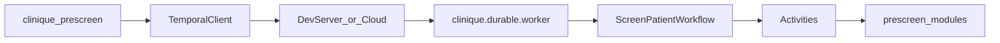

# Temporal.io durable prescreen

**Status:** implemented (local dev). Wraps the prescreen typed graph in [Temporal.io](https://github.com/temporalio/temporal) workflows and activities for durable, replayable execution.

## Naming note

This document refers to **Temporal.io** (durable execution platform). It is unrelated to:

- `src/clinique/prescreen/temporal.py` — prescreen **time-window** checks (lookback, leakage)
- The JavaScript `Temporal` date API

The Python package lives under `src/clinique/durable/` to avoid that collision.

## Architecture



| Workflow | Purpose |
|---|---|
| `ScreenPatientWorkflow` | One trial + patient screen: atomize → **parallel** per-criterion evaluate → aggregate → evidence gate → optional ledger |
| `BatchEvalWorkflow` | Eval cases via concurrent child `ScreenPatientWorkflow` runs (up to `BATCH_EVAL_CONCURRENCY`) + metrics report |

Activities are thin wrappers over existing prescreen code (`ReferenceAtomizer`, `retrieve`, `RuleJudge`, `aggregate`, `assert_evidence_provenance`). Wire payloads use **Pydantic v2** models in `durable/models.py` with `pydantic_data_converter`; domain logic still uses stdlib dataclasses from `prescreen/schemas.py`.

## Single-activity orchestrator (non-goal)

`PrescreenOrchestrator.screen()` is intentionally **not** exposed as a Temporal activity. Per-criterion activities preserve independent retry and Temporal history visibility. The sync orchestrator remains the offline oracle for tests.

## Dependencies

`temporalio` and `pydantic` are **optional** dependency group members — the core package stays stdlib-only:

```bash
uv sync --group temporal
```

CLI commands that need Temporal print `uv sync --group temporal` when the SDK is missing.

## Local development

1. Install the [Temporal CLI](https://docs.temporal.io/cli) (e.g. `brew install temporal`).

2. Start the dev server (SQLite, UI at http://localhost:8233):

   ```bash
   temporal server start-dev
   ```

3. Install the Python SDK group and start a worker:

   ```bash
   uv sync --group temporal
   uv run clinique prescreen worker
   ```

4. Run a screen via Temporal (in another terminal):

   ```bash
   # Normalize Synthea fixture first if needed
   uv run clinique prescreen normalize-synthea \
     --csv-dir tests/fixtures/prescreen/synthea \
     --snapshot 2026-03-01 \
     --out /tmp/synthea_patients.jsonl

   uv run clinique prescreen screen --temporal \
     --trial-id NCT02578680 \
     --patient-id P1 \
     --trials tests/fixtures/prescreen/trials.jsonl \
     --patients /tmp/synthea_patients.jsonl
   ```

   Omit `--temporal` to use the synchronous `PrescreenOrchestrator` path (no server/worker required).

5. Batch eval over workstream cases:

   ```bash
   uv run clinique prescreen eval-temporal \
     --cases .workstream/prescreen-copilot/l0_cases.jsonl \
     --trials tests/fixtures/prescreen/trials.jsonl \
     --synthea-patients /tmp/synthea_patients.jsonl
   ```

## CLI exit codes

| Command | Codes |
|---|---|
| `prescreen worker` | 0 running; 2 missing SDK / connect failure |
| `prescreen screen --temporal` | 0 ok; 2 input/SDK/connect; 3 workflow/gate failure |
| `prescreen eval-temporal` | 0 ok; 2 input/connect; 3 workflow failure; 9 eval thresholds |

## Testing

Workflow unit tests use Temporal's embedded `WorkflowEnvironment.start_local()` — no external dev server required:

```bash
uv sync --group temporal
uv run pytest tests/test_durable_prescreen.py tests/test_durable_models.py -q
```

End-to-end tests use **session-scoped** `temporal server start-dev` and worker fixtures (one startup per test file). They execute workflows on `localhost:7233` and cover failure injection (transient activity retry, evidence-gate non-retryable failure, batch eval error collection):

```bash
uv run pytest tests/test_durable_prescreen_e2e.py -v
```

## Invariants preserved

- **Evidence-provenance gate** runs as a non-retryable activity failure before ledger append.
- **Deterministic aggregation** stays in pure Python; the workflow only orchestrates.
- **Sync orchestrator** (`PrescreenOrchestrator.screen`) remains the offline oracle for unit tests.

## Deferred

- Human-review signals (`HumanReview.status` wait)
- Ingest/normalize durable workflows (CT.gov fetch, Synthea batch)
- Temporal Cloud / production cluster deployment
