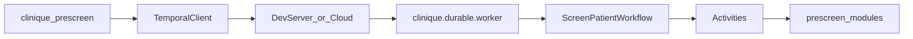
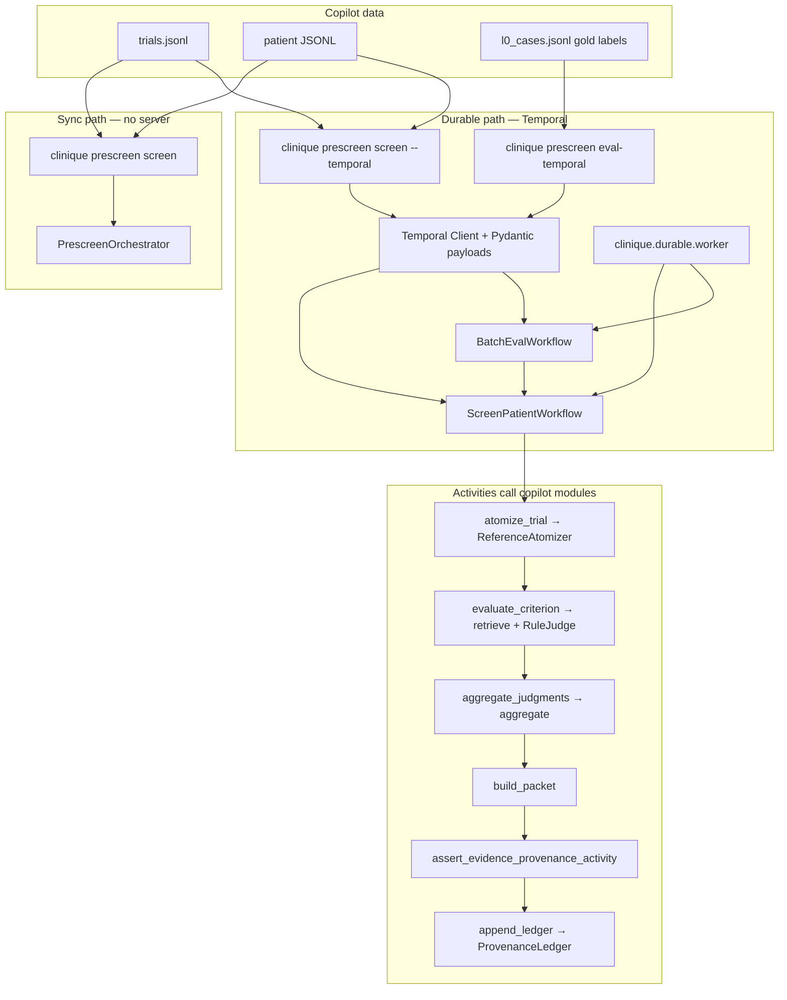

# Temporal.io durable prescreen

**Status:** implemented (local dev). Wraps the prescreen typed graph in [Temporal.io](https://github.com/temporalio/temporal) workflows and activities for durable, replayable execution.

## Naming note

This document refers to **Temporal.io** (durable execution platform). It is unrelated to:

- `src/clinique/prescreen/temporal.py` — prescreen **time-window** checks (lookback, leakage)
- The JavaScript `Temporal` date API

The Python package lives under `src/clinique/durable/` to avoid that collision.

## Architecture



| Workflow | Purpose |
|---|---|
| `ScreenPatientWorkflow` | One trial + patient screen: atomize → **parallel** per-criterion evaluate → aggregate → evidence gate → optional ledger |
| `BatchEvalWorkflow` | Eval cases via concurrent child `ScreenPatientWorkflow` runs (up to `BATCH_EVAL_CONCURRENCY`) + metrics report |

Activities are thin wrappers over existing prescreen code (`ReferenceAtomizer`, `retrieve`, `RuleJudge`, `aggregate`, `assert_evidence_provenance`). Wire payloads use **Pydantic v2** models in `durable/models.py` with `pydantic_data_converter`; domain logic still uses stdlib dataclasses from `prescreen/schemas.py`.

## Single-activity orchestrator (non-goal)

`PrescreenOrchestrator.screen()` is intentionally **not** exposed as a Temporal activity. Per-criterion activities preserve independent retry and Temporal history visibility. The sync orchestrator remains the offline oracle for tests.

## Dependencies

`temporalio` and `pydantic` are **optional** dependency group members — the core package stays stdlib-only:

```bash
uv sync --group temporal
```

CLI commands that need Temporal print `uv sync --group temporal` when the SDK is missing.

## Local development

1. Install the [Temporal CLI](https://docs.temporal.io/cli) (e.g. `brew install temporal`).

2. Start the dev server (SQLite, UI at http://localhost:8233):

   ```bash
   temporal server start-dev
   ```

3. Install the Python SDK group and start a worker:

   ```bash
   uv sync --group temporal
   uv run clinique prescreen worker
   ```

4. Run a screen via Temporal (in another terminal):

   ```bash
   # Normalize Synthea fixture first if needed
   uv run clinique prescreen normalize-synthea \
     --csv-dir tests/fixtures/prescreen/synthea \
     --snapshot 2026-03-01 \
     --out /tmp/synthea_patients.jsonl

   uv run clinique prescreen screen --temporal \
     --trial-id NCT02578680 \
     --patient-id P1 \
     --trials tests/fixtures/prescreen/trials.jsonl \
     --patients /tmp/synthea_patients.jsonl
   ```

   Omit `--temporal` to use the synchronous `PrescreenOrchestrator` path (no server/worker required).

5. Batch eval over workstream cases:

   ```bash
   uv run clinique prescreen eval-temporal \
     --cases .workstream/prescreen-copilot/l0_cases.jsonl \
     --trials tests/fixtures/prescreen/trials.jsonl \
     --synthea-patients /tmp/synthea_patients.jsonl
   ```

## CLI exit codes

| Command | Codes |
|---|---|
| `prescreen worker` | 0 running; 2 missing SDK / connect failure |
| `prescreen screen --temporal` | 0 ok; 2 input/SDK/connect; 3 workflow/gate failure |
| `prescreen eval-temporal` | 0 ok; 2 input/connect; 3 workflow failure; 9 eval thresholds |

## Testing

Workflow unit tests use Temporal's embedded `WorkflowEnvironment.start_local()` — no external dev server required:

```bash
uv sync --group temporal
uv run pytest tests/test_durable_prescreen.py tests/test_durable_models.py -q
```

End-to-end tests use **session-scoped** `temporal server start-dev` and worker fixtures (one startup per test file). They execute workflows on `localhost:7233` and cover failure injection (transient activity retry, evidence-gate non-retryable failure, batch eval error collection):

```bash
uv run pytest tests/test_durable_prescreen_e2e.py -v
```

## Invariants preserved

- **Evidence-provenance gate** runs as a non-retryable activity failure before ledger append.
- **Deterministic aggregation** stays in pure Python; the workflow only orchestrates.
- **Sync orchestrator** (`PrescreenOrchestrator.screen`) remains the offline oracle for unit tests.

## Walkthrough: copilot pipeline on Temporal

This section ties the **prescreen copilot** workstream (`.workstream/prescreen-copilot/`) to the
**Temporal durable layer** (`src/clinique/durable/`). The copilot implements a deterministic typed
graph; Temporal wraps that graph so long-running screens survive worker restarts, retry transient
failures per criterion, and batch-eval the workstream gold set with isolated per-case history.

### Copilot pipeline (sync reference)

The copilot pipeline is the same whether you run sync or durable — only the **orchestration shell**
changes:

```
Trial + PatientCorpus
  → ReferenceAtomizer        → list[Criterion]
  → per criterion:
      retrieve (BM25)        → list[Evidence]
      RuleJudge              → CriterionJudgment
  → aggregate                → recommendation string
  → build PrescreeningPacket
  → evidence-provenance gate  (hard fail if quotes don't match source docs)
  → optional ProvenanceLedger append
```

Sync entry point: `PrescreenOrchestrator().screen(trial, corpus)` in `prescreen/orchestrator.py`.
This is the **offline oracle** — durable tests assert identical packet fingerprints against it.

Workstream design and gates: `.workstream/prescreen-copilot/design.md` and
`docs/design/trial-prescreening.md`.

### How Temporal maps the pipeline



| Copilot stage | Sync | Temporal activity / workflow |
|---|---|---|
| Atomize trial | in-process | `atomize_trial` |
| Retrieve + judge per criterion | in-process loop | `evaluate_criterion` (one activity per criterion, **parallel** via `asyncio.gather`) |
| Aggregate | in-process | `aggregate_judgments` |
| Build packet | in-process | `build_packet` |
| Evidence gate | in-process, exit 8 on CLI | `assert_evidence_provenance_activity` (non-retryable failure) |
| Ledger | optional | `append_ledger` |
| Full screen | `PrescreenOrchestrator.screen` | `ScreenPatientWorkflow` child or standalone |
| L0 batch eval | `prescreen eval` | `BatchEvalWorkflow` → child `ScreenPatientWorkflow` per case |

Wire types are **Pydantic models** in `durable/models.py` (`TrialModel`, `PatientCorpusModel`,
`PrescreeningPacketModel`, …). Activities convert to stdlib dataclasses at the boundary, call
existing copilot code, and convert back.

### Prescreen copilot commands: sync vs durable

**1. Single patient screen (development / coordinator preview)**

```bash
# Sync — no Temporal server; fastest for unit work
uv run clinique prescreen screen \
  --trial-id NCT02578680 --patient-id P1 \
  --trials tests/fixtures/prescreen/trials.jsonl \
  --patients /tmp/synthea_patients.jsonl

# Durable — same copilot logic, persisted workflow history + per-criterion retry
temporal server start-dev &
uv sync --group temporal
uv run clinique prescreen worker &
uv run clinique prescreen screen --temporal \
  --trial-id NCT02578680 --patient-id P1 \
  --trials tests/fixtures/prescreen/trials.jsonl \
  --patients /tmp/synthea_patients.jsonl \
  --ledger /tmp/prescreen-ledger.jsonl   # optional provenance append
```

**2. L0 eval against copilot gold labels**

The workstream ships criterion-level gold in `.workstream/prescreen-copilot/l0_cases.jsonl`.
Each line is one `(trial_id, patient_id, snapshot_date, gold_judgments)` case.

```bash
# Sync eval → reports/prescreen/l0-eval.json
uv run clinique prescreen eval \
  --cases .workstream/prescreen-copilot/l0_cases.jsonl \
  --trials tests/fixtures/prescreen/trials.jsonl \
  --synthea-patients /tmp/synthea_patients.jsonl

# Durable batch eval → reports/prescreen/l0-eval-temporal.json
uv run clinique prescreen eval-temporal \
  --cases .workstream/prescreen-copilot/l0_cases.jsonl \
  --trials tests/fixtures/prescreen/trials.jsonl \
  --synthea-patients /tmp/synthea_patients.jsonl
```

`BatchEvalWorkflow` loads cases via `load_eval_inputs`, resolves trial + corpus per case, runs up to
`BATCH_EVAL_CONCURRENCY` (10) **concurrent** child `ScreenPatientWorkflow` runs, then scores with
`score_eval_results` (criterion accuracy, evidence violations, per-case errors). Exit code **9** if
accuracy &lt; 0.90 or errors present — same threshold posture as sync `prescreen eval`.

**3. Workstream verification gate (copilot release readiness)**

```bash
uv run clinique prescreen verify-workstream --workstream .workstream/prescreen-copilot
```

This gate checks scale datasets, conformance, atomizer coverage, gold accuracy, evidence
violations, and determinism. It uses the **sync** orchestrator today; durable batch eval is the
path for re-running the gold set under Temporal when validating worker deployments.

### Data tiers the copilot uses

| Tier | Location | Used by |
|---|---|---|
| CI micro-fixtures | `tests/fixtures/prescreen/` | pytest, quick `screen` / durable E2E |
| Workstream gold | `.workstream/prescreen-copilot/l0_cases.jsonl` | `eval`, `eval-temporal` |
| Scale corpus | `~/.clinique/datasets/prescreen-copilot/` | `verify-workstream`, scale eval |
| Manifest | `.workstream/prescreen-copilot/datasets.manifest.json` | `datasets.py` path resolution |

Override dataset root with `CLINIQUE_DATASETS_DIR` or `--datasets-dir`.

### Failure and retry semantics (why durable matters for copilot)

| Failure | Behavior |
|---|---|
| Transient error in retrieve/judge for one criterion | That criterion's activity retries (up to 3); other criteria already completed stay done |
| Evidence-provenance violation | Non-retryable — workflow fails; packet never reaches ledger (same invariant as sync exit 8) |
| Missing patient in batch eval | Per-case error collected; other cases continue |
| Worker crash mid-screen | Temporal replays workflow; completed activities are not re-run |

This is why the design keeps **per-criterion activities** instead of one monolithic
`PrescreenOrchestrator.screen()` activity: the copilot's expensive unit is one criterion, and
coordinators need visibility into which criterion failed when reviewing Temporal history.

### Observability

- **Temporal Web UI:** http://localhost:8233 (dev server) — inspect workflow history per screen
- **Workflow IDs:** `prescreen/{trial_id}/{patient_id}/{snapshot}/{tool_fingerprint}` for idempotent re-runs
- **Ledger:** JSONL append via `--ledger` on `screen --temporal`; `HumanReview.status` starts `pending`

### Quick validation checklist

```bash
uv sync --group temporal
uv run pytest tests/test_durable_models.py tests/test_durable_prescreen.py -q
uv run pytest tests/test_durable_prescreen_e2e.py -v
uv run clinique prescreen verify-workstream --workstream .workstream/prescreen-copilot
```

---

## Deferred

- Human-review signals (`HumanReview.status` wait)
- Ingest/normalize durable workflows (CT.gov fetch, Synthea batch)
- Temporal Cloud / production cluster deployment
