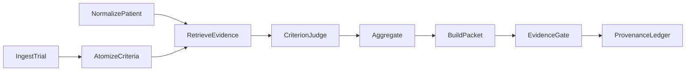

# Clinique & Prescreen Terminology Glossary

**Audience:** Anyone working on prescreen, the explorer UI, or the broader Clinique repo who needs
a quick reference for domain and repo-specific jargon.

This glossary covers terms grouped by theme. **Repo-specific** usage is called out where it differs
from general industry meaning.

---

## 1. What Clinique Is

| Term | Meaning |
|---|---|
| **Clinique** | A Python toolkit of **assistive agents** for regulated clinical-trial workflows. Agents draft, retrieve, flag, and summarize; **humans** approve, decide, enroll, and sign off. |
| **Agent / copilot** | Software that produces **review artifacts**, not final decisions. Example: a prescreening copilot says "potentially eligible; these criteria need review" — never "patient is eligible." |
| **Wedge / proof point** | The first capability chosen to prove the platform works end-to-end. Currently **trial prescreening** (criterion-level judgments with evidence). |
| **Draft-only** | Agents never write back to systems of record (EHR, EDC, CTMS). Output is advisory. |
| **Deterministic gate** | A pure, pass/fail check that runs **before** output is treated as shippable. Examples: numeric-provenance gate, conformance validation, evidence-provenance gate (proposed). |
| **Substrate** | Shared platform primitives reused across capabilities: provenance ledger, human-review records, no-fabrication guards. See [`src/clinique/substrate/`](../../src/clinique/substrate/). |

---

## 2. Clinical Trial Fundamentals

| Term | Meaning |
|---|---|
| **Clinical trial** | A controlled experiment on humans to answer whether an intervention works, is safe, and for whom. ML analogy: a high-stakes, regulated data-generation pipeline. |
| **Protocol** | The master spec for a trial — like experiment config + data schema + labeling guide + QC plan + audit log combined. |
| **Eligibility criteria** | Rules defining **who can join** a trial. Split into **inclusion** (must satisfy) and **exclusion** (must not have). This is the core input to prescreening. |
| **Inclusion criterion** | Something the patient **must** have. Example: "Age ≥ 18." If unmet → likely ineligible. |
| **Exclusion criterion** | Something the patient **must not** have. Example: "No prior anti-PD-1 therapy." If the disqualifying condition is present → likely ineligible. |
| **Prescreening / screening** | Checking whether a patient **might** meet trial eligibility before full enrollment work. Coordinators do this today manually; Clinique automates the **draft** packet. |
| **Enrollment** | Formal entry into the trial after all eligibility is confirmed — **out of scope** for the agent. |
| **Phase 1–4** | Trial stages by regulatory purpose: Phase 1 = safety/dose; Phase 2 = early efficacy signal; Phase 3 = large confirmatory; Phase 4 = post-market. Stored as `PHASE1`, `PHASE2`, etc. from ClinicalTrials.gov. |
| **Endpoint** | The outcome the trial measures (e.g. overall survival). ML analogy: **label definition** — but with strict time windows, adjudication, and blinding rules. |
| **Primary / secondary endpoint** | Main outcome vs. additional outcomes. |
| **Randomization** | Assigning patients to treatment arms by chance to reduce bias. |
| **Blinding** | Hiding treatment assignment from participants, investigators, or analysts. |
| **Adverse event (AE)** | Any unfavorable medical occurrence during the trial. |
| **Serious adverse event (SAE)** | AE requiring urgent reporting (death, hospitalization, etc.). |
| **GCP (Good Clinical Practice)** | International quality standard for trials (ICH E6). Emphasizes participant protection and reliable data. |
| **IRB / ethics review** | Institutional review board approval before human research. |

---

## 3. Prescreening Pipeline Terms

The full prescreening pipeline (from [trial-prescreening design](../design/trial-prescreening.md)):



| Term | Status | Meaning |
|---|---|---|
| **Ingestion** | Implemented | Fetch trial metadata from ClinicalTrials.gov API v2, parse into `Trial` records. |
| **Atomizer** | Proposed | LLM stage that splits raw eligibility text into **atomic criteria** — independently adjudicable predicates with operator, threshold, temporal window, etc. |
| **Normalizer** | Implemented | Converts heterogeneous patient sources (Synthea CSV, PMC text, MIMIC tables) into the shared `PatientCorpus` / `PatientDocument` model. |
| **Retriever** | Proposed | Finds patient evidence relevant to one criterion (BM25 + embeddings + structured lookup + temporal filter). |
| **Criterion judge** | Proposed | LLM that reads criterion + evidence and outputs a `CriterionJudgment` (`met`, `not_met`, `unknown`, etc.) with quotes. |
| **Aggregator** | Implemented (library) | **Deterministic** function that combines criterion judgments into an overall recommendation. No LLM. See [`aggregator.py`](../../src/clinique/prescreen/aggregator.py). |
| **Evidence-provenance gate** | Proposed | Hard check: every `met`/`not_met` must cite a quote found **verbatim** in a source document. |
| **Orchestrator** | Proposed | Typed function graph wiring all stages; builds packet, runs gates, appends to ledger. Mirrors the power orchestrator pattern. |
| **Prescreening packet** | Proposed | Final audit artifact: all criterion judgments, evidence, overall recommendation, provenance. |

**Key design rule:** LLM stages are **narrow** (atomizer, judge). Everything else — aggregation, unit conversion, temporal windows, validation — is **deterministic pure functions**.

---

## 4. Data Model Entities (Prescreen L0)

Defined in [`src/clinique/prescreen/schemas.py`](../../src/clinique/prescreen/schemas.py):

| Entity | ML analogy | Meaning |
|---|---|---|
| **`Trial`** | Task instance / prompt | One trial's eligibility specification. Contains `eligibility_text` (raw inclusion/exclusion block), demographics metadata (sex, age bounds), conditions, phase, sponsor. |
| **`AgeBound`** | Parsed feature | Age limit with raw string + normalized value in **years**. `None` means "no constraint" — never treat as zero. |
| **`PatientCorpus`** | One example's feature set | All evidence for one patient at one **`snapshot_date`** (as-of time). |
| **`PatientDocument`** | One evidence unit | A lab, condition, medication, procedure, or note chunk. Has `text` (for retrieval/citation), `structured` (machine facts), and `date` (for temporal reasoning). |
| **`Criterion`** | Atomic sub-task | Proposed. One adjudicable eligibility predicate parsed from `eligibility_text`. |
| **`Evidence`** | Retrieved context | Proposed. Patient document span(s) relevant to a criterion. |
| **`CriterionJudgment`** | Per-criterion prediction | `criterion_id` + `criterion_type` (inclusion/exclusion) + `prediction` label. |
| **`source` field** | Dataset discriminator | Tags where data came from: `clinicaltrials_gov`, `synthea`, `pmc_patients`, `mimic_iv_demo`. |

**Convergence principle:** Four heterogeneous public sources collapse onto **two** typed records — `Trial` (trial side) and `PatientCorpus`/`PatientDocument` (patient side). Validation is one contract, not four.

---

## 5. Judgment Labels & Recommendations

### Per-criterion predictions (`PREDICTIONS`)

| Label | Meaning |
|---|---|
| **`met`** | Criterion is satisfied. For **inclusion**: patient meets requirement. For **exclusion**: patient **has** the disqualifying condition → bad. |
| **`not_met`** | Criterion is not satisfied. For **inclusion**: patient fails requirement. For **exclusion**: exclusion is **cleared** with explicit negative evidence. |
| **`unknown`** | Insufficient evidence. **Never** infer clearance from silence — especially for exclusions. |
| **`not_applicable`** | Criterion doesn't apply to this patient. Ignored by aggregation. |
| **`conflicting_evidence`** | Sources disagree. Triggers human review. |

**Exclusion polarity (most error-prone):** "No evidence of prior anti-PD-1" → **`unknown`**, not `not_met`. Treating absence as clearance is forbidden.

### Overall recommendations (`RECOMMENDATIONS`)

Produced by [`aggregate()`](../../src/clinique/prescreen/aggregator.py) — priority order:

1. Any exclusion `met` OR any inclusion `not_met` → **`likely_ineligible`**
2. Any `unknown` or `conflicting_evidence` → **`needs_review`**
3. Else → **`potentially_eligible`**

Empty input → `potentially_eligible` (vacuous pass).

---

## 6. Validation Layers (L0–L4)

Clinique's **evidence ladder** — same pattern for prescreen and EDC:

| Layer | Question | ML analogue | Prescreen example |
|---|---|---|---|
| **L0** | Do deterministic pieces work? | Unit tests + schema validation | Parsers, normalizers, aggregation, `prescreen validate` |
| **L1** | Task accuracy on held-out labels? | Offline benchmark | n2c2 2018 criterion-level F1 (future judge harness) |
| **L2** | Useful as-of-time without leakage? | Temporal / leakage-safe eval | `snapshot_date` discipline; no future documents |
| **L3** | Real-world behavior, zero operational impact? | Shadow mode | Silent prospective (deferred) |
| **L4** | Causal improvement with controls? | Controlled rollout / A/B | Time-savings study with human approval (deferred) |

**Repo status:** Prescreen is at **`L0-PUBLIC-DATA`** — the data layer (fetch, parse, normalize, validate) is implemented. Atomizer/judge/retrieval are **proposed** (not L1 yet).

**Accuracy ≠ usefulness:** High criterion F1 does not prove the agent saves coordinator time. Workflow metrics (review-time reduction, correction rate) are separate ship gates.

---

## 7. Architecture & Engineering Patterns

| Term | Meaning |
|---|---|
| **Record-and-replay** | Fetch from live API once → freeze raw payload to versioned JSONL fixture → all CI/tests run offline against the fixture. ClinicalTrials.gov mutates; fixtures are the **test of record**. |
| **Fetch vs. parse split** | Network fetch (`fetch_study_raw`) is impure; parsing (`Trial.from_api`) is pure and offline-testable. Same pattern for every source. |
| **Controlled vocabulary** | Allowed enum values for fields (e.g. `TRIAL_SEX`, `DOC_SOURCE_TYPES`). Defined in `schemas.py`; enforced by `validation.py`. Unexpected value = API changed or parser bug. |
| **Conformance gate / validation** | [`validation.py`](../../src/clinique/prescreen/validation.py) checks records conform to the mental model. CLI: `prescreen validate`. Exit code **7** on errors. |
| **Leakage / no-leakage invariant** | For eval, retrieval may only use documents dated **on or before** `snapshot_date`. A document dated after snapshot = **error**. Prevents using future information. |
| **JSONL** | Newline-delimited JSON — the on-disk format for trials, patient corpora, and provenance records. |
| **Provenance ledger** | Append-only audit log of inputs, outputs, model/prompt versions, tool versions. [`substrate/provenance.py`](../../src/clinique/substrate/provenance.py). |
| **Numeric-provenance gate** | No statistic in output unless it traces to a validated engine result. Used in power orchestrator. |
| **No-fabrication guard** | Draft text must not invent facts. [`conformance/draft.py`](../../src/clinique/conformance/draft.py). |
| **HumanReview** | Dataclass recording a named human's sign-off on each packet. |
| **Pipeline stage tags** | From [clinique-for-ml.md](clinique-for-ml.md): `[NET]` network, `[FIXED]` frozen fixture, `[PURE]` deterministic, `[ENGINE]` validated compute, `[LLM]` model stage, `[GATE]` hard pass/fail, `[LEDGER]` append-only sink. |

---

## 8. Public Data Sources

| Source | Provides | Access | Role in prescreen |
|---|---|---|---|
| **ClinicalTrials.gov (CT.gov)** | Real eligibility text, conditions, phase, age/sex | Open, no auth | Trial ingestion + future atomizer input |
| **NCT ID** | Trial identifier (e.g. `NCT02578680`) | Open | Primary key for CT.gov studies |
| **Synthea** | Synthetic patients (conditions, meds, labs, procedures) | Open (Apache-2.0) | Normalizer + retrieval plumbing tests |
| **PMC-Patients** | Real free-text case reports from PubMed Central Open Access | Open (CC subset) | Realistic text for normalizer/judge |
| **MIMIC-IV demo** | 100 real de-identified patients, structured | Open (ODbL) | Structured-fact extraction; synthetic-shaped fixtures only in repo |
| **n2c2 2018 Track 1** | Real records + gold met/not-met labels (13 criteria) | **Credentialed** (Harvard DUA) | Judge benchmark — real L1/L2 signal |
| **MIMIC-IV full** | Real longitudinal records + discharge notes | **Credentialed** (PhysioNet DUA) | Retrieval at scale (deferred) |

**PHI (Protected Health Information):** Real patient identifiers or identifiable health data. Repo fixtures stay **PHI-free** — synthetic or de-identified open subsets only.

**DUA (Data Use Agreement):** Legal agreement required for credentialed datasets (n2c2, full MIMIC). Plan access time; never commit credentialed corpora.

---

## 9. Systems & Regulatory Acronyms

| Acronym | Meaning |
|---|---|
| **EDC** | Electronic Data Capture — the system sites use to enter trial data. Clinique has an EDC **query validation** wedge (separate from prescreen). |
| **EHR** | Electronic Health Record — hospital/clinic patient record system. |
| **CTMS** | Clinical Trial Management System — trial ops tracking. |
| **eTMF** | Electronic Trial Master File — regulatory document repository. |
| **CDISC** | Clinical Data Interchange Standards Consortium — standards for trial data submission (SDTM, ADaM, define.xml). Explorer has a **Regulatory CDISC** tab for FDA pilot datasets. |
| **ADaM** | Analysis Data Model — CDISC standard for analysis-ready datasets. |
| **SDTM** | Study Data Tabulation Model — CDISC standard for submitted tabulations. |
| **define.xml** | Machine-readable metadata describing SDTM/ADaM datasets and codelists. |
| **OMOP CDM** | Common data model for observational health data — future patient mapping target. |
| **FHIR** | Fast Healthcare Interoperability Resources — future EHR mapping standard. |
| **RxNorm / ATC** | Drug nomenclature / classification — proposed deterministic vocab for drug-class lookups. |
| **FDA** | U.S. Food and Drug Administration. |
| **ICH** | International Council for Harmonisation — global regulatory guidelines (e.g. E6 GCP). |

---

## 10. Prescreen CLI Commands

| Command | Purpose |
|---|---|
| `prescreen ingest` | Fetch specific NCT IDs from CT.gov → record JSONL |
| `prescreen search` | Search CT.gov with pagination → record results |
| `prescreen show` | Offline trial summary from JSONL fixture |
| `prescreen normalize-synthea` | Synthea CSV directory → `PatientCorpus` JSONL |
| `prescreen ingest-pmc` | Fetch PMC-Patients sample → record |
| `prescreen validate` | L0 conformance report (exit **7** on errors) |
| `prescreen export-explorer` | Export JSON for the web explorer dashboard |

Exit codes: **0** = success; **2** = load/fetch/parse failure; **7** = conformance errors.

---

## 11. Explorer UI Terms

The [`explorer/`](../../explorer/) app has two modes (see [`App.tsx`](../../explorer/src/App.tsx)):

| Mode | Purpose |
|---|---|
| **Prescreen L0** | Visualize schema, field distributions, patient timelines, conformance stats for prescreen public data |
| **Regulatory CDISC** | Browse FDA-pilot ADaM datasets, metadata, codelists, and row-level data |

Explorer-specific terms:

| Term | Meaning |
|---|---|
| **Schema view** | Documents `Trial`, `PatientCorpus`, `PatientDocument`, `AgeBound` fields and pipeline steps |
| **Vocab gloss** | Inline glossary of controlled-vocabulary terms in the explorer |
| **Pipeline strip** | Visual sequence: source → parse → normalize → validate |
| **Patient timeline** | Chronological view of `PatientDocument` entries for one corpus |
| **Conformance panel** | Validation errors/warnings from L0 gate |
| **Codelist** | CDISC controlled term list (value → label mappings) |
| **Domain** | CDISC dataset category (e.g. ADSL, ADAE) |

---

## 12. Metrics & Ship Gates (Future L1+)

| Term | Meaning |
|---|---|
| **Criterion-level accuracy / macro-F1** | How often per-criterion judgments match gold labels |
| **Inclusion false-negative rate** | Missing eligible patients — safety-critical |
| **Exclusion false-negative rate** | Clearing a disqualifying criterion — **must be ≤ 0.05** at ship |
| **Evidence support accuracy** | Whether cited quotes actually support the judgment |
| **Unknown rate / unknown-actionability** | Fraction of `unknown` judgments; also whether reviewers find them actionable vs. noise |
| **Review-time reduction** | Primary workflow metric — did the agent save coordinator time? |
| **Ship gates** | Pre-registered thresholds (F1 ≥ 0.80, evidence accuracy ≥ 0.85, etc.) before moving past L2 |

---

## 13. Quick Reference: Inclusion vs. Exclusion Logic

```text
INCLUSION "Age ≥ 18"
  evidence: age=62  → met        (good)
  evidence: age=16  → not_met    (likely ineligible)
  evidence: missing → unknown    (needs review)

EXCLUSION "No prior anti-PD-1"
  evidence: pembrolizumab documented → met      (likely ineligible)
  evidence: "no prior IO" explicit   → not_met  (exclusion cleared)
  evidence: nothing found            → unknown  (NOT not_met — silence ≠ clearance)
```

---

## Where to Read More

- Domain mental model: [clinical-trials-for-ml.md](clinical-trials-for-ml.md)
- Repo mapping + commands: [clinique-for-ml.md](clinique-for-ml.md)
- Prescreen design (full spec): [trial-prescreening.md](../design/trial-prescreening.md)
- Schema source of truth: [`schemas.py`](../../src/clinique/prescreen/schemas.py)
- Fixture provenance: [`PROVENANCE.md`](../../tests/fixtures/prescreen/PROVENANCE.md)
