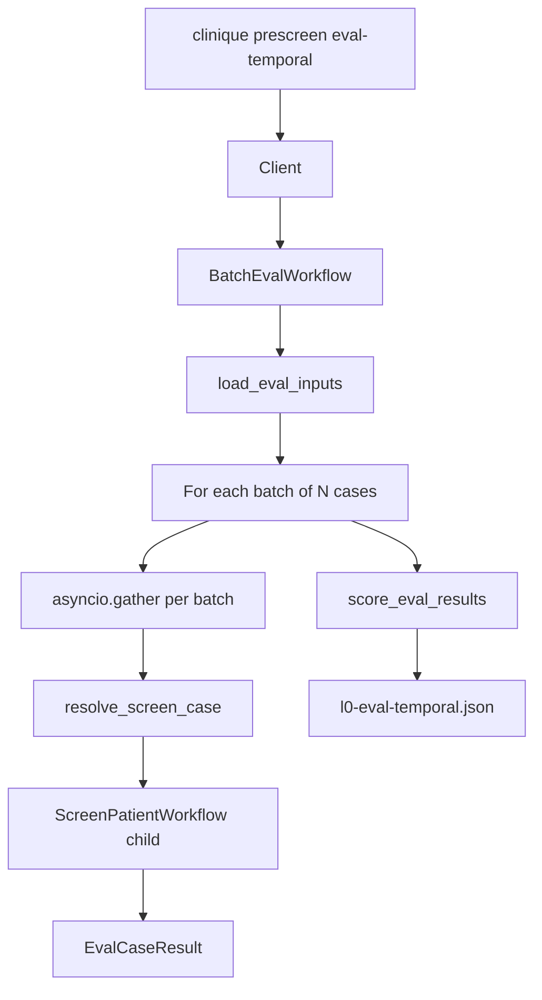

# Design Spec: Durable Prescreen Hardening

**Date:** 2026-05-24  
**Status:** Draft — pending review

## 1. Goal

Address the deferred `/simplify` items for the Temporal prescreen layer:

1. **Orchestration (option C):** parallel criterion fan-out; real batch-eval concurrency; explicit rejection of single-activity orchestrator
2. **Typed payloads:** Pydantic v2 models at the Temporal boundary with official `pydantic_data_converter`
3. **CLI deduplication:** shared Temporal runtime helper
4. **E2E speed:** session-scoped dev server + worker fixtures
5. **Serde cleanup:** remove `durable/serde.py` passthroughs in favor of Pydantic models + domain bridges

Sync `PrescreenOrchestrator.screen()` remains the offline oracle; core `prescreen/` stays stdlib-only.

## 2. Background

The durable layer (`src/clinique/durable/`) wraps prescreen in Temporal workflows and activities. Current state on `main`:

| Component | Behavior |
|---|---|
| `ScreenPatientWorkflow` | atomize → **sequential** per-criterion evaluate → aggregate → gate → optional ledger |
| `BatchEvalWorkflow` | load inputs → **sequentially** run cases in batches of 10 → score |
| Payloads | `dict[str, Any]` at workflow/activity boundaries |
| `serde.py` | Manual `*_from_dict` + one-line `*_to_dict` passthroughs |
| CLI | Duplicated `try/import/require_temporalio/connect` in three handlers |
| E2E tests | Start `temporal server start-dev` + worker subprocess **per test** (~60s suite) |

During `/simplify`, a single-activity `PrescreenOrchestrator.screen()` wrapper was **skipped** because it loses per-criterion retry granularity and Temporal history visibility. **Option C** was chosen: keep multi-activity workflow, add parallelism.

## 3. Decisions

| Decision | Choice | Rationale |
|---|---|---|
| Single-activity orchestrator | **Rejected** | All-or-nothing retry; no per-criterion history |
| Criterion parallelism | `asyncio.gather` on activities | Independent retry policies preserved |
| Batch concurrency | `asyncio.gather` on child workflows | `BATCH_EVAL_CONCURRENCY` becomes real parallelism |
| Wire types | Pydantic v2 in `durable/` only | Validated serde; optional dep group |
| Domain types | Frozen dataclasses in `prescreen/` unchanged | Stdlib-only core invariant |
| Temporal converter | `temporalio.contrib.pydantic.pydantic_data_converter` | Official SDK support; no custom codec |

## 4. Orchestration

### 4.1 ScreenPatientWorkflow

Replace the sequential criterion loop:

```python
for criterion in criteria:
    judgments.append(await workflow.execute_activity(evaluate_criterion, ...))
```

With:

```python
judgments = list(await asyncio.gather(*[
    workflow.execute_activity(
        evaluate_criterion,
        args=[criterion, data.corpus],
        start_to_close_timeout=ACTIVITY_TIMEOUT,
        retry_policy=retry,
    )
    for criterion in criteria
]))
```

**Invariants unchanged:**

- Atomize → evaluate (N activities) → aggregate → build_packet → gate → ledger
- Each criterion activity retains its own retry policy (`ACTIVITY_RETRY_MAX = 3`)
- Gate remains non-retryable (`GATE_RETRY_MAX = 1`)
- `asyncio.gather` submission order matches criteria order → deterministic judgment ordering

### 4.2 BatchEvalWorkflow

**Current:** batches of `BATCH_EVAL_CONCURRENCY` (10) cases, but cases within a batch run sequentially.

**Target:** same batching, but cases within each batch run concurrently:

```python
for batch_start in range(0, len(cases), BATCH_EVAL_CONCURRENCY):
    batch = cases[batch_start : batch_start + BATCH_EVAL_CONCURRENCY]
    batch_results = list(await asyncio.gather(*[
        self._run_case(case, inputs, parent_id, retry)
        for case in batch
    ]))
    case_results.extend(batch_results)
```

**Per-case error isolation** stays inside `_run_case` — `try/except` returns `EvalCaseResult(error=...)` so one failure does not fail the gather or the parent workflow.

**Child workflow IDs:** `{parent_id}/screen/{case_id}` (unchanged).

### 4.3 Single-activity non-goal

Document in `docs/design/temporal-prescreen.md`:

- `PrescreenOrchestrator.screen()` is the sync oracle and offline test reference
- It is intentionally **not** exposed as a Temporal activity
- Per-criterion activities provide the durable retry unit

## 5. Batch eval (detailed)

### 5.1 End-to-end flow



### 5.2 Step 1 — Load inputs (`load_eval_inputs` activity)

Reads JSONL from disk (I/O belongs in activities, not workflows):

| Input path | Loaded via |
|---|---|
| `cases_path` | `load_eval_cases()` → list of `EvalCase` |
| `trials_path` | `load_recorded_studies()` |
| `synthea_patients_path` | `load_patient_corpora(source="synthea")` |
| `pmc_patients_path` | `load_patient_corpora(source="pmc")` |
| `mimic_patients_path` | `load_patient_corpora(source="mimic")` |

Returns `LoadEvalInputsResult` (Pydantic) containing:

- `cases: list[EvalCaseModel]` — wire representation of eval cases
- `trials: list[TrialModel]`
- `corpora_by_source: dict[str, list[PatientCorpusModel]]`

JSONL rows are parsed as dicts, then validated via `Model.model_validate(row)`.

### 5.3 Step 2 — Resolve case (`resolve_screen_case` activity)

Pure lookup — no prescreen pipeline logic:

1. Find trial by `case.trial_id` in preloaded trials
2. Find corpus by `case.patient_source` + `case.patient_id` in `corpora_by_source`
3. If case specifies `snapshot_date` and corpus differs, override snapshot on a copy
4. Return `ResolvedCase(trial, corpus, gold_judgments)`

Raises `ValueError` for missing trial/patient → caught by `_run_case` → error result.

### 5.4 Step 3 — Screen case (child workflow)

Each case spawns a child `ScreenPatientWorkflow`:

```python
packet = await workflow.execute_child_workflow(
    ScreenPatientWorkflow.run,
    ScreenPatientInput(trial=resolved.trial, corpus=resolved.corpus),
    id=f"{parent_id}/screen/{case_id}",
)
```

Child workflow runs the full durable screen (with parallel criterion fan-out from §4.1). Each case gets independent retry, history, and failure semantics.

### 5.5 Step 4 — Score results (`score_eval_results` activity)

Mirrors sync `run_eval_cases()` scoring via shared `EvalMetrics`:

| Metric | Source |
|---|---|
| `criterion_accuracy` | gold_judgments vs packet.judgments |
| `evidence_violations` | `check_evidence_provenance(packet, corpus)` count |
| `exclusion_false_negatives` | exclusion + predicted `not_met` vs gold `unknown` |
| `errors` | per-case error strings |

Writes `reports/prescreen/l0-eval-temporal.json`. CLI exits **9** if accuracy < 0.90 or errors present.

### 5.6 Sync vs durable parity

| Step | Sync (`prescreen eval`) | Durable (`eval-temporal`) |
|---|---|---|
| Load | In-process | `load_eval_inputs` activity |
| Screen | `PrescreenOrchestrator().screen()` | Child `ScreenPatientWorkflow` |
| Score | `run_eval_cases()` | `score_eval_results` activity |
| Report | `l0-eval.json` | `l0-eval-temporal.json` |

Durable batch eval is the same eval loop with each `orchestrator.screen()` replaced by a child workflow.

### 5.7 Why child workflows per case

- **Independent retry** — case 3 failing does not retry cases 1–2
- **Separate Temporal history** — debug one trial/patient pair in UI
- **Bounded parallelism** — `BATCH_EVAL_CONCURRENCY` caps concurrent child workflows

Criterion-level granularity lives inside `ScreenPatientWorkflow`; case-level granularity lives at the child-workflow level.

### 5.8 Future consideration (out of scope)

For eval sets larger than ~100 cases, consider **continue-as-new** on `BatchEvalWorkflow` to avoid history size limits. Not needed for current L0 workstream case counts.

## 6. Pydantic typed payloads

### 6.1 Dependency

Add to optional `temporal` group in `pyproject.toml`:

```toml
temporal = [
    "temporalio>=1.9",
    "pydantic>=2",
    "pytest-asyncio>=0.24",
]
```

Core package dependencies remain empty (`dependencies = []`).

### 6.2 Module layout

| File | Purpose |
|---|---|
| `durable/models.py` | Pydantic v2 models for all Temporal wire types |
| `durable/converter.py` | `DATA_CONVERTER = pydantic_data_converter` |
| `durable/serde.py` | **Deleted** |

### 6.3 Model catalog

Record models mirror existing `.to_dict()` JSON shape (fixtures and JSONL stay compatible):

| Pydantic model | Domain type (`prescreen/schemas.py`) |
|---|---|
| `ThresholdModel` | `Threshold` |
| `TemporalConstraintModel` | `TemporalConstraint` |
| `CriterionModel` | `Criterion` |
| `EvidenceModel` | `Evidence` |
| `CriterionJudgmentModel` | `CriterionJudgment` |
| `TrialModel` | `Trial` |
| `PatientDocumentModel` | `PatientDocument` |
| `PatientCorpusModel` | `PatientCorpus` |
| `PrescreeningPacketModel` | `PrescreeningPacket` |

Composite / workflow models (no direct domain twin):

| Model | Used by |
|---|---|
| `ScreenPatientInput` | `ScreenPatientWorkflow` |
| `BuildPacketInput` | `build_packet` activity |
| `ResolveScreenCaseInput` / `ResolvedCase` | `resolve_screen_case` activity |
| `EvalCaseModel` | eval case wire format |
| `LoadEvalInputsResult` | `load_eval_inputs` activity |
| `EvalCaseResult` | `_run_case` return |
| `ScoreEvalInput` / `EvalReport` | `score_eval_results` activity |
| `BatchEvalInput` | `BatchEvalWorkflow` (move from dataclass) |

### 6.4 Domain bridge pattern

Each record model implements:

```python
def to_domain(self) -> Trial: ...
@classmethod
def from_domain(cls, trial: Trial) -> TrialModel: ...
```

Activities convert at the door:

```python
@activity.defn
def atomize_trial(trial: TrialModel) -> list[CriterionModel]:
    domain = trial.to_domain()
    return [CriterionModel.from_domain(c) for c in ReferenceAtomizer().atomize(domain)]
```

Existing prescreen modules (`ReferenceAtomizer`, `RuleJudge`, `aggregate`, `assert_evidence_provenance`) receive domain dataclasses only — no changes to business logic.

### 6.5 Validation

Pydantic field validators reference prescreen vocabulary constants where applicable:

- `CRITERION_TYPES`, `PREDICTIONS`, `RECOMMENDATIONS`
- `CLINICAL_DOMAINS`, `OPERATORS`
- `PATIENT_SOURCES`, `DOC_SOURCE_TYPES`

Invalid payloads fail at the Temporal boundary with clear validation errors.

### 6.6 Temporal wiring

`durable/converter.py`:

```python
from temporalio.contrib.pydantic import pydantic_data_converter
DATA_CONVERTER = pydantic_data_converter
```

Registered in:

- `durable/client.py` → `Client.connect(..., data_converter=DATA_CONVERTER)`
- `durable/worker.py` → `Worker(..., data_converter=DATA_CONVERTER)`
- Test helpers (`run_with_worker` in `tests/durable_e2e_harness.py`)

Worker subprocess inherits converter via the same module — no env var needed.

### 6.7 Drift prevention

Add round-trip tests:

```python
assert TrialModel.model_validate(trial.to_dict()).to_domain() == trial
```

Run for each record type. Existing prescreen fixture tests remain the domain oracle.

## 7. CLI deduplication

New module `durable/cli_runtime.py`:

```python
def require_temporal() -> None:
    """Import guard; raises ImportError with install hint."""

async def connect(host: str) -> Client:
    """Guard + Client.connect with DATA_CONVERTER."""

def temporal_import_error(exc: ImportError) -> int:
    """Print hint, return exit code 2."""
```

Replace duplicated blocks in `cli/prescreen.py` for:

- `screen --temporal`
- `worker`
- `eval-temporal`

## 8. E2E test harness

### 8.1 Session-scoped fixtures (`tests/conftest.py`)

```python
@pytest.fixture(scope="session")
def temporal_dev_server_session():
    with temporal_dev_server() as proc:
        yield proc

@pytest.fixture(scope="session")
def prescreen_worker_session(temporal_dev_server_session):
    with prescreen_worker() as proc:
        yield proc
```

- `temporal_dev_server()` already skips start when port `:7233` is open
- Real-server E2E tests depend on session fixtures instead of per-test context managers
- Embedded `WorkflowEnvironment` tests unchanged (no external server)

### 8.2 Expected impact

E2E file runtime: ~60s → ~15–20s (one dev server + worker startup for 4 real-server tests).

## 9. Error handling & invariants

| Scenario | Behavior |
|---|---|
| Transient activity failure | Per-activity retry (unchanged) |
| Gate failure | Non-retryable `ApplicationError`; workflow fails |
| Criterion failure after max retries | Workflow fails (same as today) |
| Batch case missing patient | `EvalCaseResult(error=...)`; batch continues |
| Batch case gate failure | Error collected; other cases continue |
| Determinism | Fixed criteria/case order + gather preserves submission order |

## 10. Testing plan

| Test | Purpose |
|---|---|
| Existing `test_durable_prescreen.py` | Update for typed models; parity + determinism + gate |
| Existing `test_durable_prescreen_e2e.py` | Session fixtures; real-server paths |
| New `test_models_roundtrip.py` | Pydantic ↔ domain round-trip for all record types |
| New `test_batch_eval_concurrency.py` | Assert gather runs cases concurrently (timing or mock) |
| Full suite | `uv run pytest -q` green |

## 11. Documentation updates

| File | Change |
|---|---|
| `docs/design/temporal-prescreen.md` | Parallel fan-out, batch concurrency, Pydantic payloads, single-activity non-goal |
| `CLAUDE.md` / `AGENTS.md` | Note `pydantic` in temporal group; session E2E fixtures |

## 12. Out of scope

- Single-activity fast path (option A)
- Child workflow per criterion (option D)
- Migrating `prescreen/schemas.py` to Pydantic
- Temporal Cloud deployment
- Custom payload converter beyond `pydantic_data_converter`
- `continue-as-new` for large eval sets

## 13. Implementation order

1. Add `pydantic` dep + `durable/models.py` + `durable/converter.py` + round-trip tests
2. Migrate activities/workflows/client/worker to Pydantic types; delete `serde.py`
3. Parallel criterion fan-out in `ScreenPatientWorkflow`
4. Real batch concurrency in `BatchEvalWorkflow`
5. CLI `cli_runtime.py` dedup
6. Session-scoped E2E fixtures
7. Doc updates
